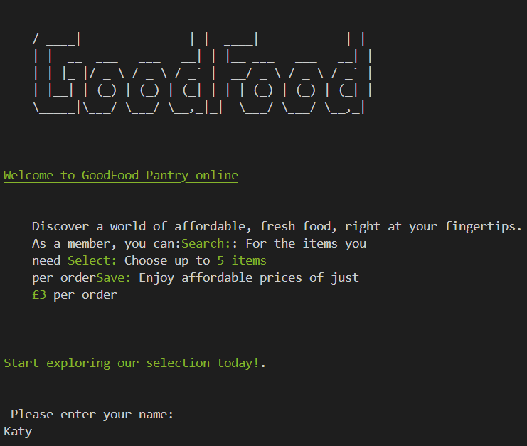
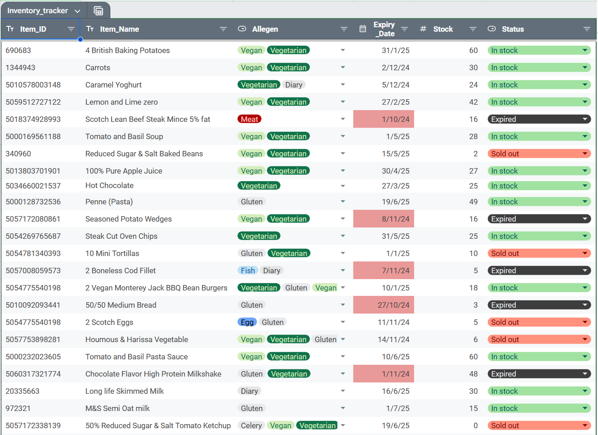
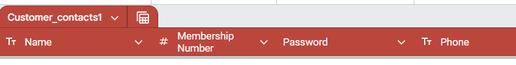
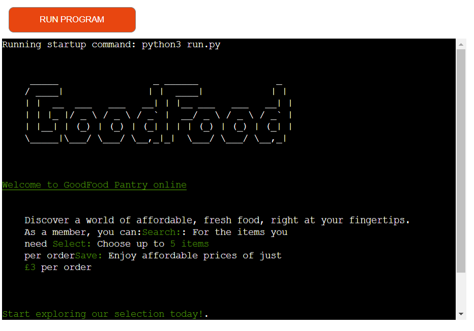
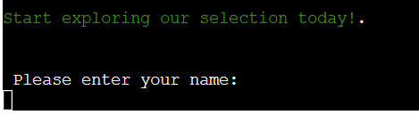
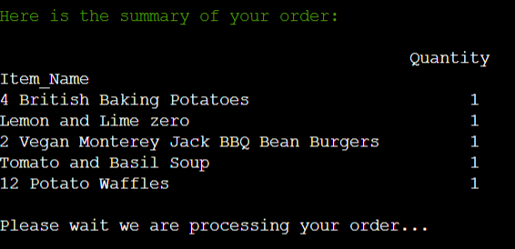
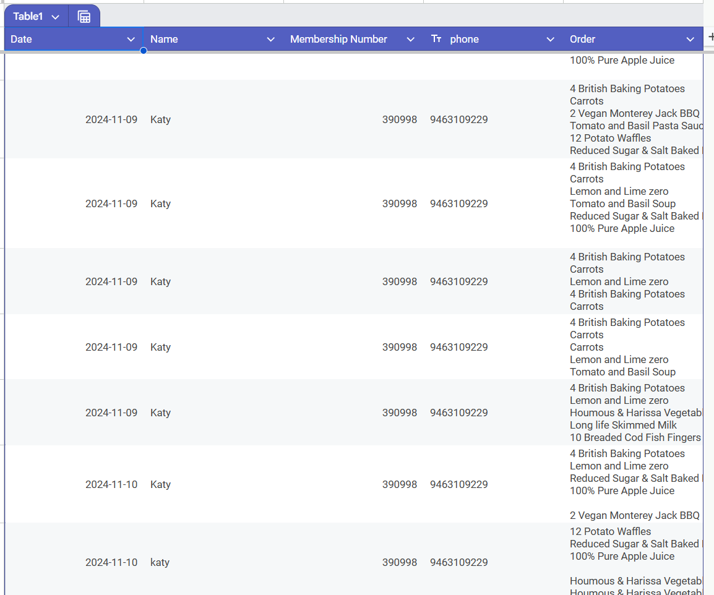

# GoodFood Online Pantry
Through our online pantry, members can conveniently search for available food items and reserve them. For a nominal fee of £3 per order, members can select up to 5 items. This initiative is supported by FareShare and HIS Food, organisations dedicated to preventing good food from ending up in landfills. While the food we offer has a shorter shelf life of approximately six months, rest assured it remains of high quality.

# Deployed site and spreadsheet
* Visit the deployed site [The deployed site](https://good-food-ebb94c0504e8.herokuapp.com/)
* Here is the spreadsheet [The Good Food Network spreadsheet]([text](https://docs.google.com/spreadsheets/d/1KtqywbYEN_j6h9RCkowc6NTNoMJqDFPrgZZhRkWVh4M/edit?usp=sharing))

# How to use this program?
To be able to use this project you will require to login. You can use **Assessor**

### Introduction
This program allows pantry members to select up to five items from the inventory based on the available stock. The system processes the order, updates the inventory, and reminds members to bring their shopping bags.
This program will help customers find out what food is in the pantry, reserve the items they want, and assist volunteers in understanding how many people they will see that day. 
* #### Check membership details
    * If the customer has placed an order in the last 7 days, they will be prompted to return after a certain number of days.
    * If the customer tries to input the wrong details more than 5 times, they will be prompted to visit the pantry.
* #### Select items
    * Using the index number, the user selects the item they would like to add to their bag.
    * The customer can select up to 5 items from the available stock.
    * There is a timeout function: if they take more than 5 minutes after selecting their first item, the items in their basket will be returned to inventory, and they will need to restart their browser and enter their name again.
    * If the user inputs an invalid value (e.g., a number not in the list, a letter, or a symbol), they will be prompted to select a valid number from the list.
    * After each item is selected, the stocklist is updated.
* #### Display basket
    * Users can see what is in their shopping basket.
* #### Update inventory spreadsheet
    * Each selected item is deducted from the inventory.
    * If the user is inactive for more than 5 minutes, the items will be returned to the inventory.
* ### Timeout
    * To prevent items from sitting in a customer's basket, if the user is inactive for 5 minutes, the items are returned to the inventory.
* ### Completed Order
    * The order is then written back to the spreadsheet.

# User Experience
Due to the nature of pantries, items go quickly, and people will be looking for what new stock has been delivered. Especially, when they can get premium supermarket products (Waitrose and MS) produce for £3 per shop.

* Most users will be using mobile phones to search.
* Users will be introduced to the program when they sign up to become a member. Giving them opportunity to ask questions and learn to navigate the programme in-person.
* Most of the people will be those in work but are struggling to feed their families. So they are likely to be short of money and time.
* Depending on the app's popularity, the opening times of the pantry may be extended for working people. 
* Give members an idea of what is currently in stock.

# Features
* Minimal writing due to users predominantly looking at the program on their mobile phone
* Allegens are clearly labelled with all produce based on the OpenFoodFacts data.
* Basket to keep track of products
* The order spreadsheet is updated with name, membership, phone number, and a list of items
* The inventory is live and will update after each user selection. This means items can be sold out in the middle of a customers order. 

# Future Features
* In future iterations, the spreadsheet won’t need to be manually updated.
* If a user makes a mistake, they will need to reload the page. However, being able to remove items from the basket would be advantageous.
* The search by item isn’t publicized as there is currently no way to go back to the full stock list or for your basket to remain the same once the page is reloaded.
* An automated order number to will be generated to further support the volunteers.
* To have all the pantries in the area to have access to the app, so those who can drive are able to access a wider variety of food.
* Allow users to remove items from the bag without having to refresh their browser. 
* A full login system that allows users to change their password

## Spreadsheets
* Here is the spreadsheet [The Good Food Network spreadsheet]([text](https://docs.google.com/spreadsheets/d/1KtqywbYEN_j6h9RCkowc6NTNoMJqDFPrgZZhRkWVh4M/edit?usp=sharing))

### Inventory
The inventory automatically calculates when stock has expired, sold out and is in stock. After the user has entered their details.
* **Sold out** - when there is no more stock (this can occur in the middle of an order)
* **Expired** - todays date is after the expiry date
* **In stock** - the food is in date and there is stock in the inventory 

### Customers
The customer spreadsheet stores the names of the customers and matches their phone and membership number. 
*The names and phone numbers are randomly generated and do not reflect real people*

### Orders
The last step in the process is the order sheet that is automatically updated with name, membership number, phone and order at the end of the process.

## The program
The Ascii Art Logo provides users a less daunting experience, considering the program has been developed to run in the terminal. The front page allows users to clearly understand the purpose of the program, how to use it and the cost. 

## Membership verification
The membership verification takes the users name and matches it to the customers spreadsheet. It is validated to ensure the user input matches to the records. This information is then used to populate the orders spreadsheet at the end of the process.

## Search
The search function is based on Pandas DataFrame, which allows for users to search dietary needs and what is in stock. Although, they can search by product, it is still in development. The search function would be greatly enhanced with JavaScript. To enhance this feature, it would be useful if users could exclude items based on the allergens. 

## Product selection
User can select their products by using the index number in the left-hand column. The interface is straight forward with clear labelling. It is possible for users to select multiple items and add them into the shopping basket. 

## Error Handling 
### ValueError 
* If a user selects a number not in the list an error message will occur  
>Please enter a number to select an item
* If the user is inactive and the session times out, they will need to restart their browser.
> “You cannot continue ordering as the timeout has occurred. Please restart your browser”
* If an item sells out between the customer's initial view of in-stock items and the moment they submit their final item, a message will appear indicating that the item is now sold out.
>Sorry, that item has sold out
* If a user selects an item that is not in the index
>I can't seem to find that item, please try again

When the incorrect KeyValue or Index key. It triggers a loop that will only stop when the user put's in the right value. For instance, one on the search page, it the user enters a number that isn't in the DataFrame then they will be prompted to select another option.

## Order Summary
At the end of the programme there is an order summary, followed be a processing order screen  

# Planning
LucidCharts has been instrumental in this project to be able view and map our processes. In the chart it shows both the existing and future features and how they will interact.

[Link to LucidCharts](https://lucid.app/lucidspark/9d193c9a-8b28-4968-a4e3-9c766bd2af64/edit?viewport_loc=-3816%2C-440%2C5527%2C3233%2C0_0&invitationId=inv_572656d0-633b-4b66-a027-e52888674aa7)

## Design
* White lettering 
* Green accented colours

# Technology Used
[Python](https://en.wikipedia.org/wiki/Python_(programming_language))

# Frameworks, Libraries and Programs
* [CI Python Linter](https://pep8ci.herokuapp.com/)
    * Verify code
* [Copilot]([text](https://copilot.microsoft.com/chats/xM5NAg8bbqQJscBdB7dWd))
    * Realtime coding suggestions used for comments, error handling, and code.
    * Used to refactor one large function (bag function) into multiple reusable functions.
    * Found resources to help debug based on error messages.
    * Rewrote and formatted code to ensure it passed the linter.
* [Gemini](https://gemini.google.com/?utm_source=google&utm_medium=cpc&utm_campaign=2024enGB_gemfeb&gad_source=1&gclid=Cj0KCQiA0MG5BhD1ARIsAEcZtwQiAgaOnBwcdEg71JOF0GmNrW7GcviDrIQd9qIUwImjCcesufAKCUcaAkvrEALw_wcB&gclsrc=aw.ds)
    * Brainstorm ideas and find search terms, tutorial video, for coding errors. As well as in the development of this README file.
* [Google Cloud](https://cloud.google.com/)
    * Used the API service to securely connect Google Sheets 
* [Google Sheet](https://workspace.google.com/intl/en_uk/products/sheets/)
    * Storing data about products, customers and orders
* [Gitpod](https://gitpod.io/)
    * Write code, debugging and issue logging
* [Github ](https://github.com/)
    * Deploy program, store file and version control
* [Heroku](https://id.heroku.com/login)
    * Deploy the project
* [LucidChart ](https://www.lucidchart.com/pages/?)
    * To map the logic of the program 

# Testing
Testing was undertaken using CI Python Linter and in built functions in VS Code. In both cases the code passed. 

## Manual testing
| Feature | Expected Result | Steps Taken | Actual Result| 
|----------|----------------|-------------|---------------|
|Greetings message | Display the logo and message | None | Pass - no issues | 
| Introduction | Inform and engage customers | After focus group feedback, the message was changed to include alliteration. | The original idea was to have bullet points. However, the formatting made it harder to read. |
| Login and verification of membership | The user enters their name and a welcome message pop up | users are given 5 attempts before a personalised message appears | Pass - Achieved expected results.|
Welcome message | A description of how to find food | The focus groups suggested making all language relate to food | Exceeded expectations the use of colour means information in broken up. |
| Inventory table | Stock to be displayed in a table |Users can select inventory by using the index numbers | Exceeded exceptions - the table is well organised and include just the right Information. Areas for development - to have the content left aligned. Also, to have different colours to help users pick the right item| 
Instruction for selecting food | Have the index numbers in a different colour to support users finding their items | Currently not developed | Functional table however, with the coloured index column it would be a better user experience
Basket | not in the original plan | None | Good use of colour, however the first line is out of alignment |
| Order summary | Not in original plan, however, became apparent that being able to calculate the inventory and stock, there needed be a way for multiple items to be selected to be counted. | None | meets expectations |
| Processing order message | Not in the original plan however, it was required because due to the potential loading time that could occur whilst it updates the orders spreadsheet. Having processing message would help user experience | The focus group appreciated this step and felt it gave them reinsurance that the program was still working. | Met expectations |
| Inventory | the inventory function retrieves data from spreadsheet to build the spreadsheet. It would then update with the order once the order had been completed | Manual test to see if the inventory is updated after timeout has occured and after each user selection | Pass  |
| Orders spreadsheet |To take the orders based on user input and write them back to the spreadsheet | The main testing for this portion happened during the testing of other functions | This exceeded the original idea as it allowed for orders to be written as a list. However, area for development would be to have the calculated version so it could prevent human error | 
Order confirmation message | This messaged aimed to give the user instruction about collecting their order and what to expect. | This message tested well with the focus group over they did mention it should include a thank you and explain what impact using the pantry has on the planet. | This message met expectations 
| Timeout after 5 minutes | Items in the shopping bag will return to the inventory  | manual testing - Various amount of items were added to the bag to see if they would be returned to inventory spreadsheet. | Passed - Items returned to the bag.  

### To many orders
If a customer has already placed an order within the last seven days, they will receive a message informing them that they can only order once a week. The message will also display the number of days they need to wait before they can place another order. Additionally, the message will include the Good Food logo to enhance customer relationship and brand recognition. 

The image also shows that the case the customer uses will be transformed into a title.

### Sold out mid order
If an item sells out during the middle of an order, the customer will receive a message informing them that the item has sold out and will be directed to select a different item. This feature allows multiple customers to use the program simultaneously while maintaining accurate inventory.

### Membership error handling
The image demonstrates the various ways customers could input incorrect data into the membership section. If they are not a member, they are then directed to go into the shop. Customers have five attempts to enter the data correctly before the program stops, to reduce brute force attacks. Due to the person-centred approach the volunteers offer, only people who are registered with the pantry are allowed to collect food. There is already a door-to-door service for those who struggle to access the provision.
 

# Resolving API speed

Throughout the programme there was many times when API is required from reading the current stock levels and writing back with the customer’s order. To reduce the number of times the API was called, I used threading. Initially, I asked Copilot to review my code and provided prompts regarding potential ways to speed up the code. Unfortunately, with Copilot's solution focused  answers it suggested using `concurrent.futures`, and directed me to resources where I could learn about it. During this process, I realised that `concurrent.futures` was just another module, similar to threading. Since I was more familiar with threading, I opted to use it instead.

Using a tutorial, I created the `combined_api_calls` function. I then used Copilot with the prompt "Do not give me the answer but coach me." This allowed me to ask Boolean questions and discuss my assumptions. One issue I encountered was that multiple arguements were being fed into the function, but they were not always used simultaneously. To address this, I asked Copilot to show me resources to help me to resolve the `TypeError` which occured because too many positional arguments were being passed. It directed me to search for passing arguments with values as `None` for future reference. I created an `if` statement which initially did not work. I then set the initial arguements to have a value of `None`, and this allowed the `if` statement to function correctly.

Another issue I faced was an error message being printed to the terminal, even though the program continued to run as expected. To resolve this, I introduced a `try` and `except` statement that printed an appropriate message in line with the program's purpose as an online pantry.

# Known bugs

* **Logo Display Issue (Heroku Terminal):**
    * The Good Food logo, intended to be displayed at the start of the program, does not render correctly in the Heroku terminal. Instead, it is rendered above the visible terminal viewport, requiring users to scroll up to view it. 
* **Multiple Allergens Display Issue (Heroku):**
    * When food items with multiple allergens, like th `Houmous & Harissa Vegetable` are displayed on the Heroku site, the allergen information is not formatted correctly. 
* **Time and Order Completion (Experimental):**
    * The timeout functionality and `order_complete` handling were experimental. Currently, when the order timer expires, the user is prompted to restart the browser. Ideally, the `membership_details` function should be automatically re-executed after the timeout, allowing the user to re-enter their information without restarting. This would significantly improve the user experience.
* **Counter Doubling:**
    * The input validation for user details allows five attempts. However, the `shop_or_exit` variable is used in two separate validation loops, causing the counter to increment twice for each failed attempt. This effectively halves the number of allowed attempts, reducing it from five to approximately two or three. 
* **Global Variables:**
    * The code uses global variables (`order_complete`, `order_timer`, `time_out_occurred`) which could introduce unintended side effects and make the code harder to maintain and debug. While no issues have been observed during testing, using global variables increases the risk of unexpected behavior as the application scales or is modified.
* **Spreadsheet Conditional Formatting:**
    * The spreadsheet's conditional formatting for order status is applied after the user enters their name in the membership number function. If a volunteer views the spreadsheet before this step, the formatting will be incorrect this could lead to confusion.
* **Spreadsheet Item Titles:**
    * When the customers completed order is written back to the spreadsheet, the column headers `items_name` and `quantity` are included within the order's item list. These should be removed to improve usability
* **Item Removal Limitation:**
    * The application lacks functionality to remove items from an order after they are added. If a customer adds an item in error, they must restart the browser and begin the order from scratch. Implementing an item removal feature would significantly improve the user experience.

# Setting up & Deployment

## Deployment

### Deploying to Heroku

To deploy with Heroku, Code Institute Python Essentials Template was used so the python code can be viewed in a terminal in a browser
1.  Log in to Heroku or create a new account
2.  On the main page click `New` and select `Create new app`
3.  Choose your unique app name and select your region
4.  Click `Create app`
5.  On the next page find `settings` and locate `Config Vars`
6.  Click `Reveal Config Vars` and add `PORT` key and value `8000`, click `Add`
7.  Scroll down, locate `Buildpack` and click `Add`, select `Python`
8.  Repeat step 7. only this time add `Node.js`, make sure `Python` is first
9.  Scroll to the top and select `Deploy` tab
10. Select GitHub as deployment method and search for your repository and link them together
11. Scroll down and select either `Enable Automatic Deploys` or `Manual Deploy`
12. Deployed site Good-Food

### Forking the GitHub Repository
By forking the repository, we make a copy of the original repository on our GitHub account to view and change without affecting the original repository by using these steps:
1.  Log in to GitHub and locate Good-Food
2.  At the top of the Repository(under the main navigation) locate `Fork` button.
3.  Now you should have a copy of the original repository in your GitHub account.

### Local Clone
1.  Log in to GitHub and locate  
2.  Under the repository name click `Clone or download`
3.  Click on the code button, select clone with HTTPS, SSH or GitHub CLI and copy the link shown.
4.  Open Git Bash
5.  Change the current working directory to the location where you want the cloned directory to be made.
6.  Type git clone and then paste The URL copied in the step 3.
7.  Press Enter and your local clone will be created.

### Deployment to Heroku
1.  Create a Heroku App:
    * Log in to Heroku or create a new account.
    * Click `New App` and provide a unique name.
    * Select your preferred region.
2.  Configure Buildpacks:
    * In the app's settings, navigate to `Buildpacks`.
    * Add the following buildpacks in this order: 
        1.  Python
        2.  Node.js
3.  Set Environment Variable:
    Under "Config Vars," add a new key-value pair: 
     * Key: `PORT`
     * Value: `8000`
4.  Connect to GitHub Repository:
    * Go to the `Deploy` tab.
    * Select `GitHub` as the deployment method.
    * Search for your forked repository and connect it to the Heroku app.
5.  Deploy:
    * Choose between `Enable Automatic Deploys` or `Manual Deploy` to your preference.

### Forking the GitHub Repository
1.  Log in to GitHub.
2.  Locate the Repository: Find the Good-Food repository.
3.  Fork the Repository: Click the `Fork` button to create a copy in your account.

### Cloning the Repository Locally
1.  Navigate to the Repository: Go to your forked repository on GitHub.
2.  Copy the Clone URL: Click the "Code" button and copy the HTTPS or SSH URL.
3.  Open a Terminal: 
    * Navigate to your desired local directory.
    * Run the following command, replacing the URL with the copied one:

### 1. Create a New Google Cloud Platform Project:

* Sign in to your Google Cloud Platform account.
* Create a new project and name it appropriately.

### 2. Enable Required APIs:
* Navigate to the APIs & Services section of your project.
* Search for and enable the following APIs:
    * Google Drive API
    * Google Sheets API

### 3. Create a Service Account:
* In the APIs & Services section, go to Credentials.
* Click Create Credentials and select Service Account.
* Provide a name for the service account.
* Grant the service account the Editor role.
* Generate a Service Account Key:

### 4. Select the newly created service account.
* Go to the Keys tab and click Add Key.
* Choose Create new key and select the JSON key type.
* Download the generated JSON file.

### Using the Service Account Key in Your Python Script
You'll need to use the downloaded JSON key file in your Python script to authenticate with the Google Cloud Platform and access your Google Sheet. Here's a basic outline of the steps:

### 1. Install required libraries
`pip install google-auth-oauthlib google-auth-httplib2 googleapiclient.discovery`

### 2. Set Up Authentication:

* Use the `google.oauth2.service_account` module to authenticate with your service account key.
* This will provide you with credentials to access the Google Sheets API.

### 3. Access the Google Sheet:

Use the `googleapiclient.discovery` module to build a service object for the Sheets API.
Use the service object to make API calls to read or write data to your Google Sheet.

> Most importantly, keep your account service key secure and store creds.json file in your `.gitignore`

# References

## DataFrame
### linking gspread to pandas
https://medium.com/@vince.shields913 reading-google-sheets-into-a-pandas-dataframe-with-gspread-and-oauth2-375b932be7bf
### Clearing Data
https://www.youtube.com/watch?v=mvbnhfdDrro

### Changing today's date
https://www.geeksforgeeks.org/get-current-date-using-python/ - 
https://www.programiz.com/python-programming/datetime''
https://strftime.org/
Python strftime cheatsheet
https://www.geeksforgeeks.org/convert-the-column-type-from-string-to-datetime-format-in-pandas-dataframe/#pandas-convert-column-to-datetime-using-pdto_datetime-function

### Logo
https://www.asciiart.eu/text-to-ascii-art
 
### Resolving SettingWithCopyWarning issue
https://www.analyticsvidhya.com/blog/2021/11/3-ways-to-deal-with-settingwithcopywarning-in-pandas/
https://medium.com/@vince.shields913/reading-google-sheets-into-a-pandas-dataframe-with-gspread-and-oauth2-375b932be7bf
https://www.dataquest.io/blog/settingwithcopywarning/

### Writing back to Google Sheet
https://medium.com/@jb.ranchana/write-and-append-dataframes-to-google-sheets-in-python-f62479460cf0#:~:text=Once%20you%20write%20the%20data,tolist()%20before%20appending.
    
## Search_Results
### Searching DataFrames
https://pandas.pydata.org/docs/reference/api/pandas.Series.str.contains.html
https://www.reddit.com/r/learnpython/comments/9n39zy/search_string_in_multiple_columns_pandas/?captcha=1

### Create a DataFrame
https://www.geeksforgeeks.org/different-ways-to-create-pandas-dataframe/
https://pythonhosted.org/gspread-dataframe/

### Validation
https://flexiple.com/python/python-capitalize-first-letter

## Order Amount
### Flatten List
https://python.shiksha/tips/count-occurrences-of-a-list-item-in-python/
https://realpython.com/python-flatten-list/

### Turn into dictionary DataFrame 
https://www.geeksforgeeks.org/how-to-create-dataframe-from-dictionary-in-python-pandas/

### Renaming Columns
https://www.geeksforgeeks.org/how-to-rename-multiple-column-headers-in-a-pandas-dataframe/

### Inner Joing
https://www.kdnuggets.com/2023/03/3-ways-merge-pandas-dataframes.html

### Subtract columns

https://www.tutorialspoint.com/how-to-subtract-two-columns-in-pandas-dataframe 

### NaN

https://note.nkmk.me/en/python-pandas-nan-fillna/

https://saturncloud.io/blog/how-to-replace-none-with-nan-in-pandas-dataframe/#:~:text=The%20simplest%20way%20to%20replace,replace%20None%20values%20with%20NaN%20.

https://www.geeksforgeeks.org/convert-floats-to-integers-in-a-pandas-dataframe/

### Changing colours in the terminal
https://saturncloud.io/blog/how-to-print-colored-text-to-the-terminal/

## Conditional updating Pandas
https://www.geeksforgeeks.org/how-to-replace-values-in-column-based-on-condition-in-pandas 
* Used in the project

## Threading

### Time delay
https://www.sqlpey.com/python/top-10-methods-to-implement-time-delay-in-pythonmd/#2-threadingtimer
https://www.youtube.com/watch?v=IEEhzQoKtQU&ab_channel=CoreySchafer

### Copilot resource suggestion
https://www.youtube.com/watch?v=cdPZ1pJACMI&ab_channel=TechWithTim

## Credit
* GeeksforGeeks 
* [Corey Schafer's Pandas Tutorials](https://www.youtube.com/@coreyms)
* Pandas 2.2.3 documentation
* Python 3.11.3 documentation
https://pythonhosted.org/gspread-dataframe/

# Content
Content was written by me with assist of Gemini for grammatical rewrites

# Acknowledgements
The tutors and mentors at the Code Institute, the Slack community who are always there when things go wrong and the fabulous focus group and testers Team Amazing!

