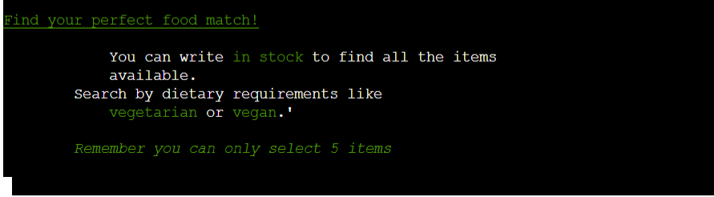
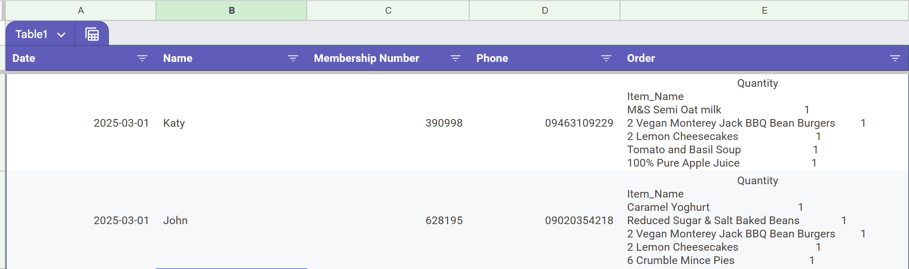

# GoodFood Online Pantry
Through our online pantry, members can conveniently search for available food items and reserve them. For a nominal fee of £3 per order, members can select up to 5 items. This initiative is supported by FareShare and HIS Food, organisations dedicated to preventing good food from ending up in landfills. While the food we offer has a shorter shelf life of approximately six months, rest assured it remains of high quality.

visit the deployed site [here](https://good-food-ebb94c0504e8.herokuapp.com/)

# How to use this program?
To be able to use this project you will require to login. You can use **Assessor**

### Introduction
This program allows pantry members to select up to five items from the inventory based on their dietary requirements and availability. The system processes the order, updates the inventory, and reminds members to bring their shopping bags. The implementation of this project would the volunteers have a clear understanding how many people the will be seeing. 

The volunteer will then get a short message telling them the computer is processing their order followed this is when the order spreadsheet is updated.  about a thank you message directing them to the shop and not to forget their shopping bag.

Customers are given a brief introduction when they become members of the pantry. They are then asked to provide their name, which matches their membership number, and a welcome message is displayed. Having an online service, means customers are well aware of what is on offer. So they are not taking unnecessary trips. 

Next, they are prompted to search the inventory with options like what is in stock and any dietary requirements such as being vegetarian or vegan. They are reminded that they can only pick 5 items.

Once they type their selection, the inventory linked to a spreadsheet is displayed, allowing users to select up to 5 items using the index on the left-hand side. At the bottom of the screen, their basket contents are displayed.

Once they have finished selecting the quantity of items they want, the product status is updated as taken. They then receive a short message informing them that the computer is processing their order.

Finally, a thank you message directs them to the shop and reminds them not to forget their shopping bag.

# User Experience
Due to the nature of pantries, items go quickly, and people will be looking for what new stock has been delivered. Especially, when they can get premium supermarket products (Waitrose and MS) produce for £3 per shop.

* Most users will be using mobile phones to search.
* Users will be introduced to the program when they sign up to become a member. Giving the opportunity to ask questions and learn to navigate it with guidance.
* Most of the people will be those in work but are struggling to feed their Families. So they are likely to be short of money and time.
* Depending on the app's popularity, the opening times of the pantry may be extended for working people. 
* Give members an idea of what is currently in stock.

# Features
* Minimal writing due to users predominantly looking at the program on their mobile phone
* Inventory search – dietary requirements, uses OpenFoodFacts data which provides allergen advice and product codes. It would be possible to provide the full list of ingredients of products
* Although it asks for the words "vegan" and "vegetarian", the first four letters would be enough. This will be demonstrated to those in the shop.
* Search for all available stock
* Basket to keep track of products
* The order spreadsheet is updated with name, membership, phone number, and a list of items

# Future Features
* In future iterations, the spreadsheet won’t need to be manually updated.
* If a user makes a mistake, they will need to reload the page. However, being able to remove items from the basket would be advantageous.
* The search by item isn’t publicized as there is currently no way to go back to the full stock list or for your basket to remain the same once the page is reloaded.
* An order number will be generated to prevent confusion.
* To have all the pantries in the area to have access to the app, so those who can drive are able to access a wider variety of food.

## Spreadsheets

## Spreadsheets

### Inventory
The inventory automatically calculates when stock has expired, sold out and is in stock. To prevent over ordering online, anything under 10 is considered out of stock. Currently volunteers will need to manually update the spreadsheet when they get an order. 

### Customers
The customer spreadsheet stores the names of the customers and matches their phone and membership number. 
*The names and phone numbers are randomly generated and do not reflect real people*

### Orders
The last step in the process is the order sheet that is automatically updated with name, membership number, phone and order at the end of the process.

## The program
The Ascii Art Logo provides users a less daunting experience, considering the program has been developed to run in the terminal. The front page allows users to clearly understand the purpose of the program, how to use it and the cost. It also includes a call to action to encourage people to volunteer.

## Membership verification
The membership verification takes the users name and matches it to the customers spreadsheet. It is validated to ensure the user input matches to the records. This information is then used to populate the orders spreadsheet at the end of the process.

## Search
The search function is based on Pandas DataFrame, which allows for users to search dietary needs and what is in stock. Although, they can search by product, it is still in development. The search function would be greatly enhanced with JavaScript. To enhance this feature, it would be useful if users could exclude items based on the allergens. 

## Product selection
User can select their products by using the index number in the left-hand column. The interface is straight forward with clear labelling. It is possible for users to select multiple items and add them into the shopping basket. 

## Error Handling 
When the incorrect KeyValue or Index key. It triggers a loop that will only stop when the user put's in the right value. For instance, one on the search page, it the user enters a number that isn't in the DataFrame then they will be prompted to select another option.

## Order Summary
At the end of the programme there is an order summary, followed be a processing order screen  

# Planning
LucidCharts has been instrumental in this project to be able view and map our processes. In the chart it shows both the existing and future features and how they will interact.

[Link to LucidCharts](https://lucid.app/lucidspark/9d193c9a-8b28-4968-a4e3-9c766bd2af64/edit?viewport_loc=-3816%2C-440%2C5527%2C3233%2C0_0&invitationId=inv_572656d0-633b-4b66-a027-e52888674aa7)

## Design
* White lettering 
* Green accented colours

# Technology Used
[Python](https://en.wikipedia.org/wiki/Python_(programming_language))

# Frameworks, Libraries and Programs
* [Google Cloud](https://cloud.google.com/)
    * Used the API service to securely connect Google Sheets 
* [Google Sheet](https://workspace.google.com/intl/en_uk/products/sheets/)
    * Storing data about products, customers and orders
* [Gitpod](https://gitpod.io/)
    * Write code, debugging and issue logging
* [Github ](https://github.com/)
    * Deploy program, store file and version control
* [LucidChart ](https://www.lucidchart.com/pages/?)
    * To map the logic of the program 
* [Heroku](https://id.heroku.com/login)
    * Deploy the project
* [CI Python Linter](https://pep8ci.herokuapp.com/)
    * Verify code
* [Gemini](https://gemini.google.com/?utm_source=google&utm_medium=cpc&utm_campaign=2024enGB_gemfeb&gad_source=1&gclid=Cj0KCQiA0MG5BhD1ARIsAEcZtwQiAgaOnBwcdEg71JOF0GmNrW7GcviDrIQd9qIUwImjCcesufAKCUcaAkvrEALw_wcB&gclsrc=aw.ds)
    * Brainstorm ideas and find search terms, tutorial video, for coding errors. As well as in the development of this README file.

# Testing
Testing was undertaken using CI Python Linter and in built functions in GitPod. Unfortunately, this presented conflicts

## Manual testing
| Feature | Expected Result | Steps Taken | Actual Result| 
|----------|----------------|-------------|---------------|
|Greetings message | Display the logo and message | None | pass - no issues | 
| Introduction | Inform and engage customers | After focus group feedback, the message was changed to include alliteration. | The original idea was to have bullet points. However, the formatting made it harder to read. |
| Login and verification of membership | The user enters their name and a welcome message pop up | validates user input, preventing moving on before check and a personalised message appears | Pass - Achieved expected results. Area for development - the error message is not grammatically correct when now name is entered. |
Welcome message | A description of how to find food | The focus groups suggested making all language relate to food | Exceeded expectations the use of colour means information in broken up. |
| Inventory table | Stock to be displayed in a table |Users can select inventory by | Exceeded exceptions - the table is well organised and include just the right Information. Areas for development - to have the content left aligned. Also, to have different colours to help users pick the right item| 
Instruction for selecting food | Have the index numbers in a different colour to support users finding their items | Currently not developed | Functional table however, with the coloured index column it would be a better user experience
Basket | not in the original plan | None | Good use of colour, however the first line is out of alignment |
| Order summary | Not in original plan, however, became apparent that being able to calculate the inventory and stock, there needed be a way for multiple items to be selected to be counted. | None | meets expectations |
| Processing order message | Not in the original plan however, it was required because due to the potential loading time that could occur whilst it updates the orders spreadsheet. Having processing message would help user experience | The focus group appreciated this step and felt it gave them reinsurance that the program was still working. | Met expectations |
| Inventory | the inventory function retrieves data from spreadsheet to build the spreadsheet. It would then update with the order once the order had been completed | | Unfortunately the customer data isn't written back to the spreadsheet |
| Orders spreadsheet |To take the orders based on user input and write them back to the spreadsheet | The main testing for this portion happened during the testing of other functions | This exceeded the original idea as it allowed for orders to be written as a list. However, area for development would be to have the calculated version so it could prevent human error | 
Order confirmation message | This messaged aimed to give the user instruction about collecting their order and what to expect. | This message tested well with the focus group over they did mention it should include a thank you and explain what impact using the pantry has on the planet. | This message met expectations |

# Resolving SettingWithCopyWarning issue warning.
I first identified the issue in the console, at the time I did not have logging installed which would have been useful at the time. I watched various YouTube videos topic and read gspread documentations. Although it was a warning the meant I was altering a copy of the data rather than the actual Data. I was affecting my code in the shopping function. To evaluate my knowledge, I used Gemini to review my code and asked for it to coach me to the right answer. It would then provide me with a structure question to help me to debug my code. By supplying Gemini with my assumptions, it would either confirm my suspicions or I would ask for link to YouTube video or articles to help me to understand. 
Although the I was able to resolve the issue with the shopping function. I ran out of time to be able to resolve the same issue in the inventory function.

# Known bugs

A bug occurs on the selection DataFrame if a user press enter accidentally, showing an empty DataFrame. Currently, the only fix is to refresh the page and start over.

# Setting up & Deployment

## Deployment

### Deploying to Heroku

To deploy with Heroku, Code Institute Python Essentials Template was used so the python code can be viewed in a terminal in a browser
1.  Log in to Heroku or create a new account
2.  On the main page click "New" and select "Create new app"
3.  Choose your unique app name and select your region
4.  Click "Create app"
5.  On the next page find "settings" and locate "Config Vars"
6.  Click "Reveal Config Vars" and add "PORT" key and value "8000", click "Add"
7.  Scroll down, locate "Buildpack" and click "Add", select "Python"
8.  Repeat step 7. only this time add "Node.js", make sure "Python" is first
9.  Scroll to the top and select "Deploy" tab
10. Select GitHub as deployment method and search for your repository and link them together
11. Scroll down and select either "Enable Automatic Deploys" or "Manual Deploy"
12. Deployed site Good-Food

### Forking the GitHub Repository
By forking the repository, we make a copy of the original repository on our GitHub account to view and change without affecting the original repository by using these steps:
1.  Log in to GitHub and locate Good-Food
2.  At the top of the Repository(under the main navigation) locate "Fork" button.
3.  Now you should have a copy of the original repository in your GitHub account.

### Local Clone
1.  Log in to GitHub and locate  
2.  Under the repository name click "Clone or download"
3.  Click on the code button, select clone with HTTPS, SSH or GitHub CLI and copy the link shown.
4.  Open Git Bash
5.  Change the current working directory to the location where you want the cloned directory to be made.
6.  Type git clone and then paste The URL copied in the step 3.
7.  Press Enter and your local clone will be created.

### Deployment to Heroku
1.  Create a Heroku App:
    * Log in to Heroku or create a new account.
    * Click "New App" and provide a unique name.
    * Select your preferred region.
2.  Configure Buildpacks:
    * In the app's settings, navigate to "Buildpacks."
    * Add the following buildpacks in this order: 
        1.  Python
        2.  Node.js
3.  Set Environment Variable:
    Under "Config Vars," add a new key-value pair: 
     * Key: `PORT`
     * Value: `8000`
4.  Connect to GitHub Repository:
    * Go to the "Deploy" tab.
    * Select "GitHub" as the deployment method.
    * Search for your forked repository and connect it to the Heroku app.
5.  Deploy:
    * Choose between "Enable Automatic Deploys" or "Manual Deploy" to your preference.

### Forking the GitHub Repository
1.  Log in to GitHub.
2.  Locate the Repository: Find the Good-Food repository.
3.  Fork the Repository: Click the "Fork" button to create a copy in your account.

### Cloning the Repository Locally
1.  Navigate to the Repository: Go to your forked repository on GitHub.
2.  Copy the Clone URL: Click the "Code" button and copy the HTTPS or SSH URL.
3.  Open a Terminal: 
    * Navigate to your desired local directory.
    * Run the following command, replacing the URL with the copied one:

### 1. Create a New Google Cloud Platform Project:

* Sign in to your Google Cloud Platform account.
* Create a new project and name it appropriately.

### 2. Enable Required APIs:
* Navigate to the APIs & Services section of your project.
* Search for and enable the following APIs:
    * Google Drive API
    * Google Sheets API

### 3. Create a Service Account:
* In the APIs & Services section, go to Credentials.
* Click Create Credentials and select Service Account.
* Provide a name for the service account.
* Grant the service account the Editor role.
* Generate a Service Account Key:

### 4. Select the newly created service account.
* Go to the Keys tab and click Add Key.
* Choose Create new key and select the JSON key type.
* Download the generated JSON file.

### Using the Service Account Key in Your Python Script
You'll need to use the downloaded JSON key file in your Python script to authenticate with the Google Cloud Platform and access your Google Sheet. Here's a basic outline of the steps:

### 1. Install required libraries
`pip install google-auth-oauthlib google-auth-httplib2 googleapiclient.discovery`

### 2. Set Up Authentication:

* Use the `google.oauth2.service_account` module to authenticate with your service account key.
* This will provide you with credentials to access the Google Sheets API.

### 3. Access the Google Sheet:

Use the `googleapiclient.discovery` module to build a service object for the Sheets API.
Use the service object to make API calls to read or write data to your Google Sheet.

> Most importantly, keep your account service key secure and store creds.json file in your `.gitignore`

# References

## DataFrame
### linking gspread to pandas
https://medium.com/@vince.shields913 reading-google-sheets-into-a-pandas-dataframe-with-gspread-and-oauth2-375b932be7bf
### Clearing Data
https://www.youtube.com/watch?v=mvbnhfdDrro

### Changing today's date
https://www.geeksforgeeks.org/get-current-date-using-python/ - 
https://www.programiz.com/python-programming/datetime''
https://strftime.org/
Python strftime cheatsheet
https://www.geeksforgeeks.org/convert-the-column-type-from-string-to-datetime-format-in-pandas-dataframe/#pandas-convert-column-to-datetime-using-pdto_datetime-function

### Logo
https://www.asciiart.eu/text-to-ascii-art
 
### Resolving SettingWithCopyWarning issue
https://www.analyticsvidhya.com/blog/2021/11/3-ways-to-deal-with-settingwithcopywarning-in-pandas/
https://medium.com/@vince.shields913/reading-google-sheets-into-a-pandas-dataframe-with-gspread-and-oauth2-375b932be7bf
https://www.dataquest.io/blog/settingwithcopywarning/

### Writing back to Google Sheet
https://medium.com/@jb.ranchana/write-and-append-dataframes-to-google-sheets-in-python-f62479460cf0#:~:text=Once%20you%20write%20the%20data,tolist()%20before%20appending.
    
## Search_Results
### Searching DataFrames
https://pandas.pydata.org/docs/reference/api/pandas.Series.str.contains.html
https://www.reddit.com/r/learnpython/comments/9n39zy/search_string_in_multiple_columns_pandas/?captcha=1

### Create a DataFrame
https://www.geeksforgeeks.org/different-ways-to-create-pandas-dataframe/
https://pythonhosted.org/gspread-dataframe/

### Validation
https://flexiple.com/python/python-capitalize-first-letter

## Order Amount
### Flatten List
https://python.shiksha/tips/count-occurrences-of-a-list-item-in-python/
https://realpython.com/python-flatten-list/

### Turn into dictionary DataFrame 
https://www.geeksforgeeks.org/how-to-create-dataframe-from-dictionary-in-python-pandas/

### Renaming Columns
https://www.geeksforgeeks.org/how-to-rename-multiple-column-headers-in-a-pandas-dataframe/

### Inner Joing
https://www.kdnuggets.com/2023/03/3-ways-merge-pandas-dataframes.html

### Subtract columns

https://www.tutorialspoint.com/how-to-subtract-two-columns-in-pandas-dataframe 

### NaN

https://note.nkmk.me/en/python-pandas-nan-fillna/

https://saturncloud.io/blog/how-to-replace-none-with-nan-in-pandas-dataframe/#:~:text=The%20simplest%20way%20to%20replace,replace%20None%20values%20with%20NaN%20.

https://www.geeksforgeeks.org/convert-floats-to-integers-in-a-pandas-dataframe/

### Changing colours in the terminal
https://saturncloud.io/blog/how-to-print-colored-text-to-the-terminal/

## Conditional updating Pandas
https://www.geeksforgeeks.org/how-to-replace-values-in-column-based-on-condition-in-pandas 
* Used in the project

### Time delay
https://www.sqlpey.com/python/top-10-methods-to-implement-time-delay-in-pythonmd/#2-threadingtimer

## Credit
* GeeksforGeeks 
* [Corey Schafer's Pandas Tutorials](https://www.youtube.com/@coreyms)
* Pandas 2.2.3 documentation
* Python 3.11.3 documentation
https://pythonhosted.org/gspread-dataframe/

# Content
Content was written by me with assist of Gemini for grammatical rewrites

# Acknowledgements
The tutors and mentors at the Code Institute 
The Slack community who are always there when things go wrong. 
The fabulous focus group and testers Team Amazing

